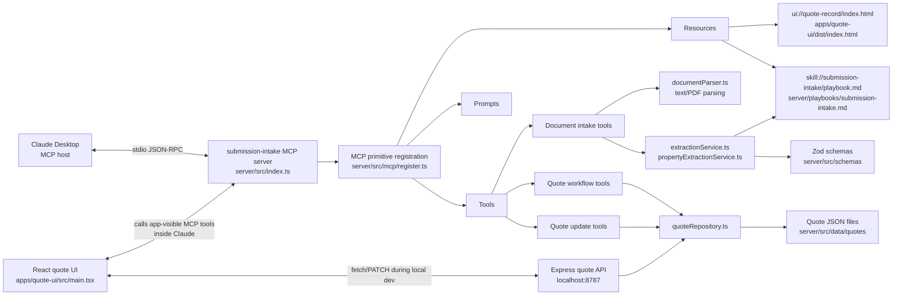
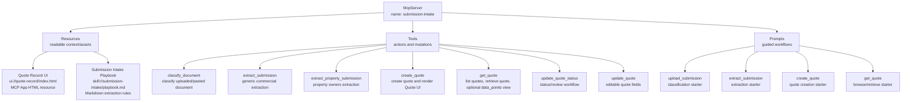
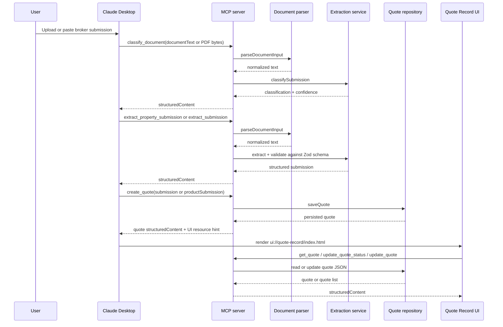

# MCP Architecture Mapping

This project is a local MCP server plus an embedded MCP App UI and a small HTTP sidecar for standalone UI development.

## Project Shape

## MCP Primitives

## Request Flow

## Why Each Primitive Fits

| Primitive | Project usage | Why it fits |
|---|---|---|
| Resource | `ui://quote-record/index.html` | Static app asset that Claude can render. |
| Resource | `skill://submission-intake/playbook.md` | Reference/context read by clients and services. |
| Tool | `classify_document`, `extract_submission`, `extract_property_submission` | Deterministic work over user-provided input. |
| Tool | `create_quote`, `get_quote`, `update_quote_status`, `update_quote` | Quote workflow actions and data access. |
| Prompt | `upload_submission`, `extract_submission`, `create_quote`, `get_quote` | Reusable instructions that guide Claude to call the right tools. |

## Source Files

| Area | File |
|---|---|
| MCP bootstrap and Express sidecar | `server/src/index.ts` |
| MCP resource/tool/prompt registration | `server/src/mcp/register.ts` |
| Quote persistence | `server/src/services/quoteRepository.ts` |
| Document parsing | `server/src/services/documentParser.ts` |
| Generic extraction | `server/src/services/extractionService.ts` |
| Property owners extraction | `server/src/services/propertyExtractionService.ts` |
| Product schemas | `server/src/schemas` |
| Embedded MCP App source | `apps/quote-ui/src/main.tsx` |
| Built MCP App resource | `apps/quote-ui/dist/index.html` |
